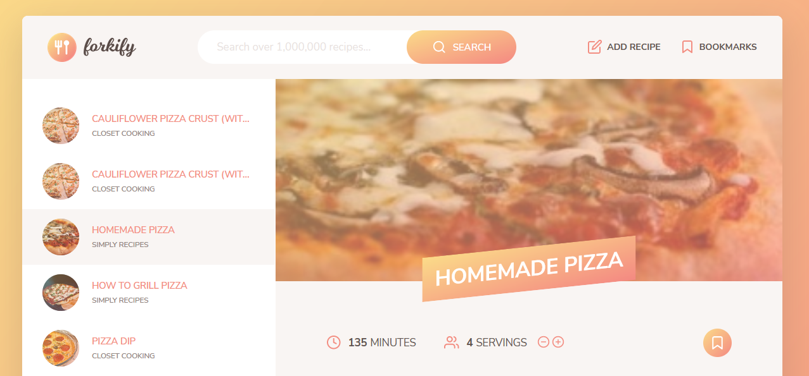

# forkify

[Forkify](https://forkifyproject-jem.netlify.app) is a recipe website built using the MVC architecture. Recipes are from the forkify [API](https://forkify-api.herokuapp.com/api/v2/recipes/). Alternate link for the site can be found [here](https://11jem.github.io/jsproj-forkify/).

## Features

- Upload recipes
- Bookmark recipes
- Pagination
- Error and success messages
- Persisting of data to local storage

## File structure

1. `index.html` - homepage of forkify
1. `src/img` - icons
1. `src/js` - model, views, and controller
1. `src/sass` - scss files
